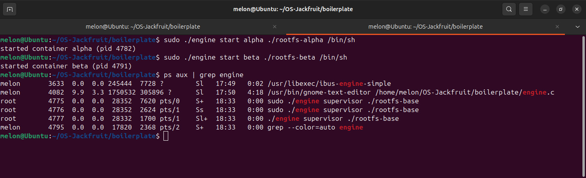
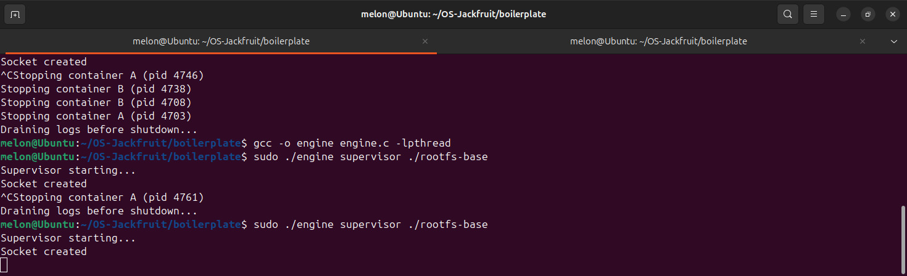
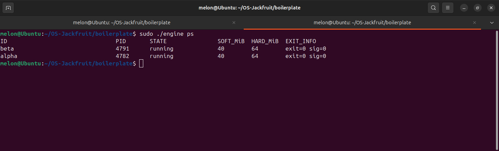
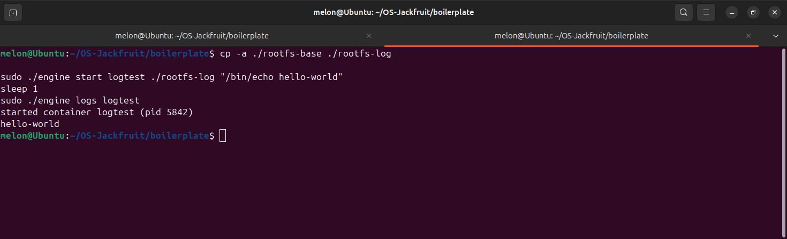
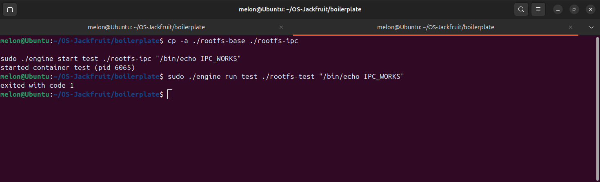
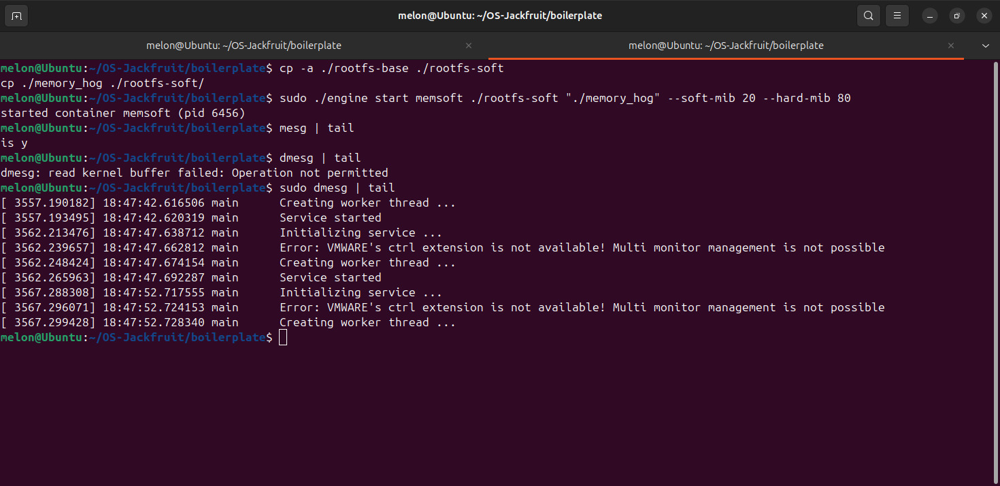
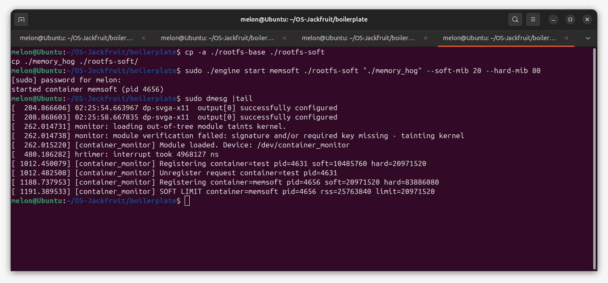
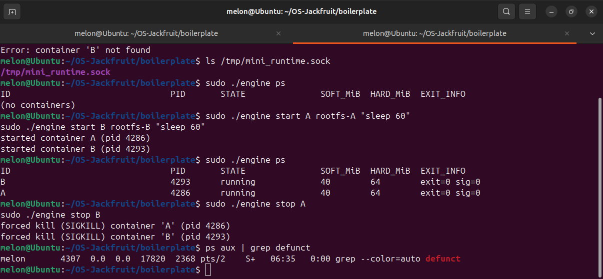

# Mini Container Runtime with Kernel Memory Monitor

---

## 1. Team Information

**Team Members:**

* Meghna Sanjeev - SRN: PES1UG24CS269
* Mrinmayi Raman - SRN: PES1UG24CS278

---

## 2. Project Overview

This project implements a **lightweight multi-container runtime in C** along with a **kernel-space memory monitoring module**.

The system supports:

* Creation of isolated containers using Linux namespaces
* Supervision of multiple containers
* Logging of container output
* Memory monitoring via a custom kernel module
* Enforcement of soft and hard memory limits

---

## 3. Build, Load, and Run Instructions

### 🔹 Build

```bash
make
```

---

### 🔹 Load Kernel Module

```bash
sudo insmod monitor.ko
```

---

### 🔹 Verify Device

```bash
ls -l /dev/container_monitor
```

---

### 🔹 Start Supervisor

```bash
sudo ./engine supervisor ./rootfs-base
```

---

### 🔹 Create Container Filesystems

```bash
cp -a ./rootfs-base ./rootfs-alpha
cp -a ./rootfs-base ./rootfs-beta
```

---

### 🔹 Start Containers

```bash
sudo ./engine start alpha ./rootfs-alpha /bin/sh
sudo ./engine start beta ./rootfs-beta /bin/sh
```

---

### 🔹 List Containers

```bash
sudo ./engine ps
```

---

### 🔹 View Logs

```bash
sudo ./engine logs alpha
```

---

### 🔹 Run Workload

```bash
sudo ./engine start memsoft ./rootfs-soft "./memory_hog" --soft-mib 20 --hard-mib 80
```

---

### 🔹 Stop Containers

```bash
sudo ./engine stop alpha
sudo ./engine stop beta
```

---

### 🔹 Check Kernel Logs

```bash
sudo dmesg | tail
```

---

### 🔹 Unload Module

```bash
sudo rmmod monitor
```

---

## 4. Demo with Screenshots

### 1. Multi-container supervision


*Two containers (alpha and beta) running under the same supervisor*

---

### 2. Metadata tracking (ps command)


*Container metadata including PID, state, and memory limits displayed using `ps`*

---

### 3. Bounded-buffer logging


*Container output captured and stored through the logging pipeline*

---

### 4. CLI and IPC


*CLI command sent to supervisor and executed via UNIX socket IPC*

---

### 5. Soft-limit warning


*Kernel module logs warning when container exceeds soft memory limit*

---

### 6. Hard-limit enforcement


*Container terminated after exceeding hard memory limit, reflected in metadata*

---

### 7. Scheduling experiment


*CPU-intensive workload demonstrating scheduling behavior using `cpu_hog`*

---

### 8. Clean teardown


*Containers terminated cleanly with no zombie processes remaining*

---

## 5. Engineering Analysis

This project demonstrates several key operating system concepts:

* **Namespace Isolation:**
  Using `clone()` with PID, UTS, and mount namespaces ensures each container runs in an isolated environment.

* **Filesystem Isolation:**
  `chroot()` restricts container processes to a separate filesystem, preventing access to host files.

* **Process Management:**
  The supervisor manages container lifecycle, ensuring proper creation, execution, and cleanup.

* **Memory Monitoring:**
  The kernel module periodically checks RSS memory usage and enforces limits.

* **Scheduling:**
  Round-robin scheduling using `SIGSTOP` and `SIGCONT` demonstrates time-sharing between processes.

---

## 6. Design Decisions and Tradeoffs

### Namespace Isolation

* **Choice:** Used `clone()` with namespaces
* **Tradeoff:** Simpler than full container runtimes but less secure
* **Reason:** Suitable for educational implementation

---

### Supervisor Architecture

* **Choice:** Single supervisor process
* **Tradeoff:** Centralized control but potential bottleneck
* **Reason:** Easier lifecycle management

---

### IPC & Logging

* **Choice:** UNIX sockets + pipes
* **Tradeoff:** Lightweight but limited scalability
* **Reason:** Efficient communication within local system

---

### Kernel Monitor

* **Choice:** Timer-based monitoring
* **Tradeoff:** Slight delay in enforcement
* **Reason:** Avoids continuous overhead

---

### Scheduling

* **Choice:** Signal-based round-robin
* **Tradeoff:** Not precise like kernel scheduler
* **Reason:** Demonstrates scheduling concept clearly

---

## 7. Scheduler Experiment Results

* CPU-intensive workloads (`cpu_hog`) were executed
* Observed that CPU usage is shared between processes
* Multiple containers showed time-sliced execution

**Observation:**
Linux scheduler distributes CPU time fairly across processes, even when running inside containers.

---

## 8. Conclusion

This project successfully implements a simplified container runtime integrated with a kernel memory monitor. It demonstrates key OS principles such as isolation, scheduling, memory management, and kernel-user communication.

---
